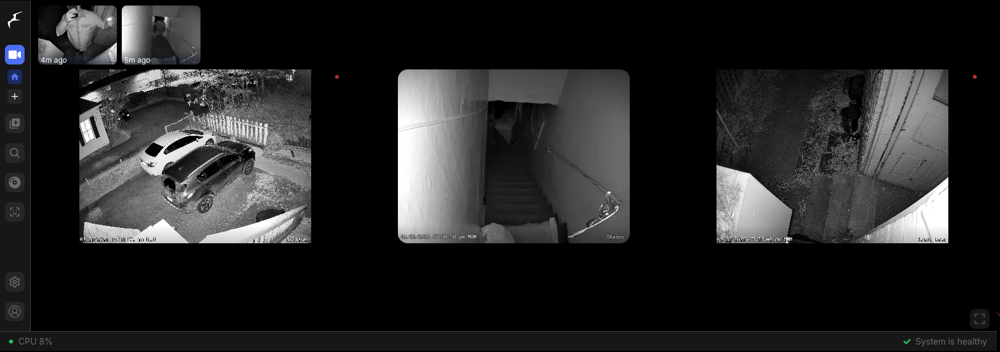
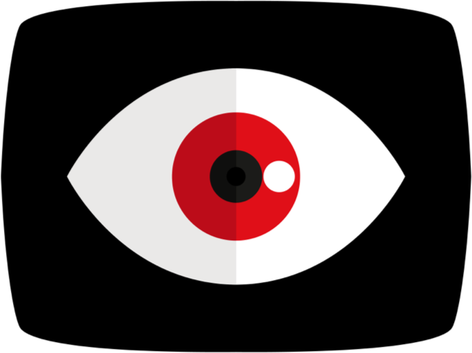
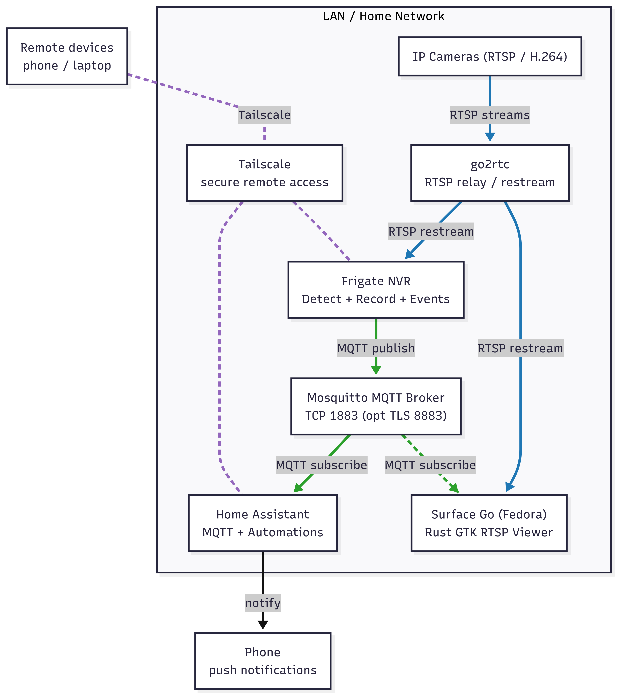
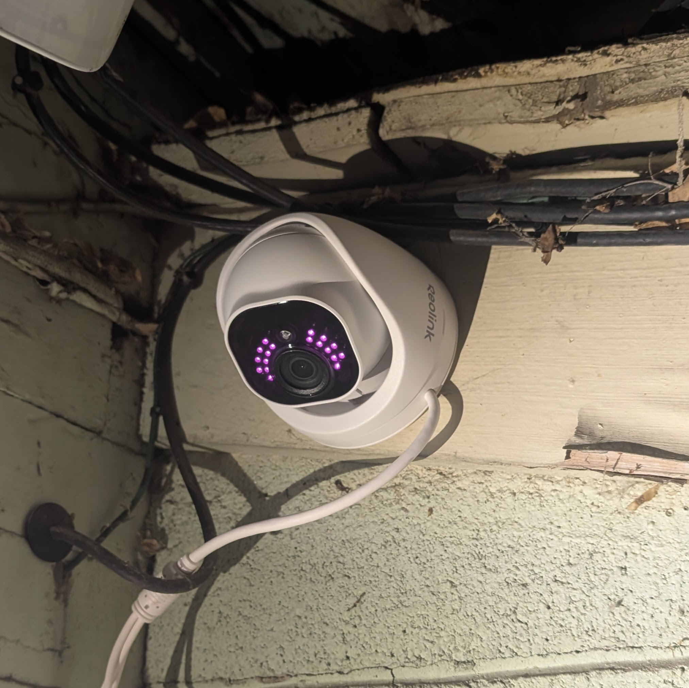
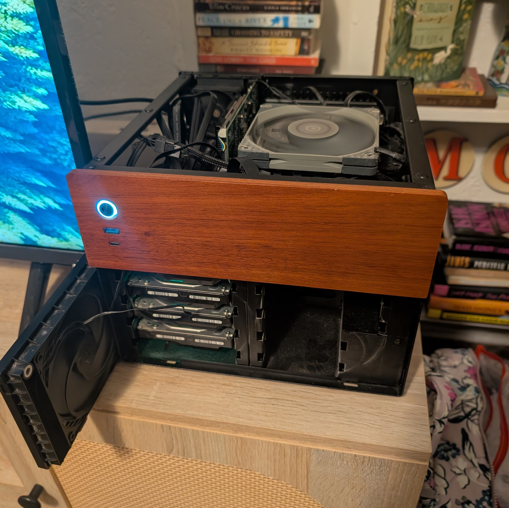
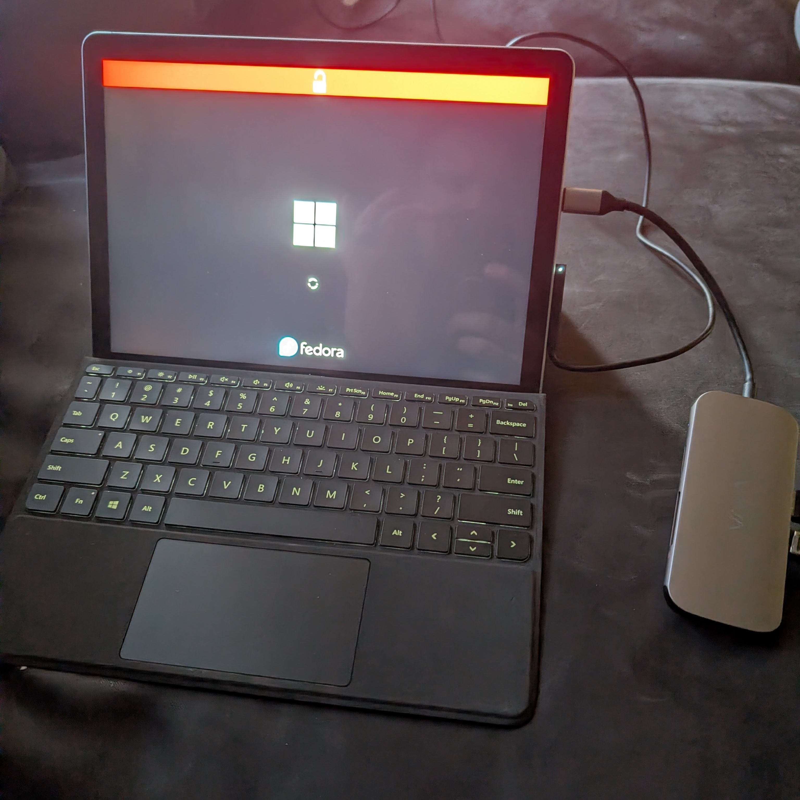
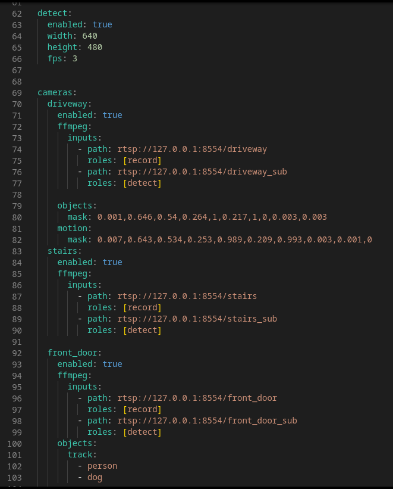
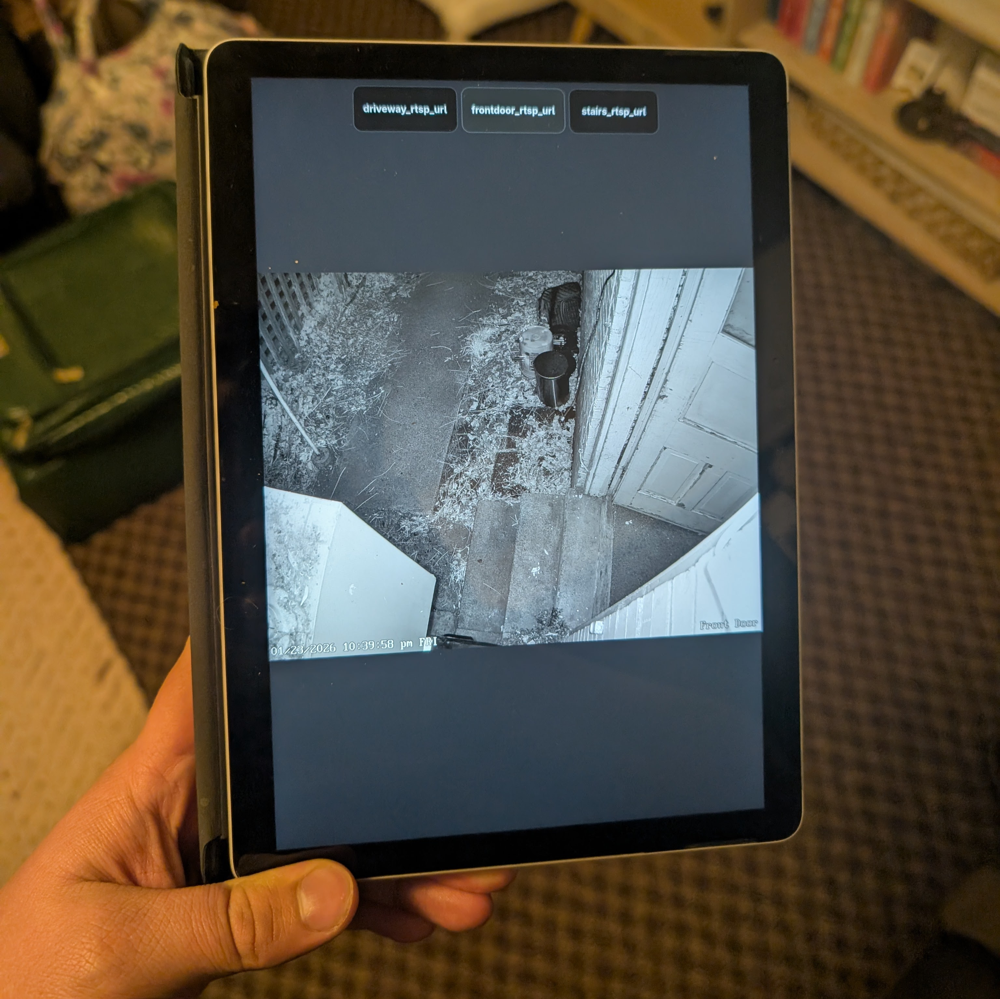
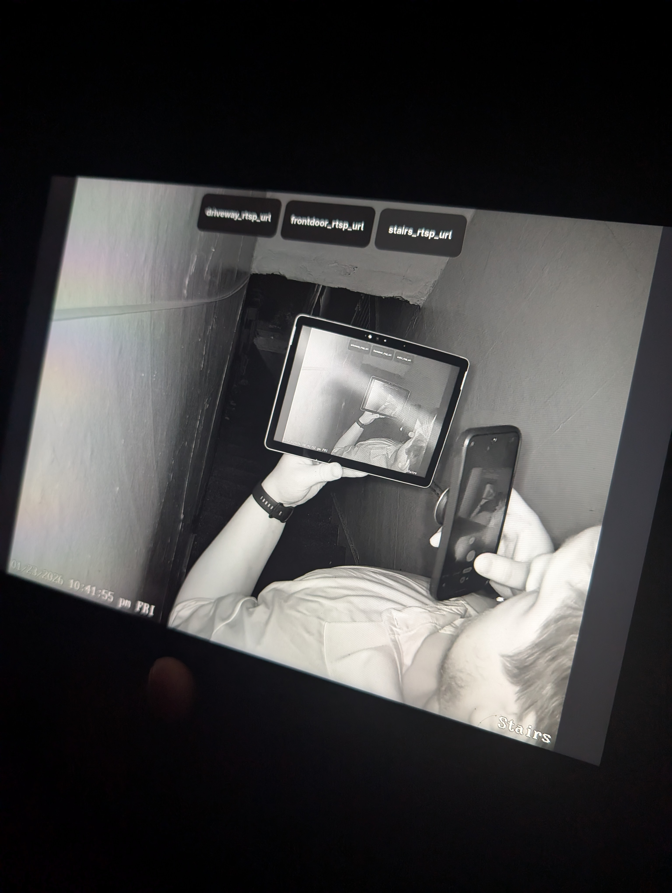

# Self Hosted Security Cameras

The goal of this project is to migrate to a system of security cameras that are self-hosted, customizable, and private.

## Skills Developed 

####  Docker
I got practice using docker compose to set up and deploy several different services. I learned about the importance of persistent volumes for data storage, and how to configure services to communicate with each other over a docker network. 

####  MQTT
In setting up an MQTT broker and making it accessible to other services, I gained some better understanding about pub/sub architectures, and how MQTT can be used to facilitate communication from IoT devices. I got some practice with how asynchronous event handling works in this kind of architecture. 

####  RTSP, go2rtc and IP video
I learned about the RTSP protocol for streaming video over a network, and how to configure IP cameras to stream their footage to a local server. I better understand H.264/H.265 video encoding, and how to use go2rtc to transcode and relay video streams. 

####  Computer Vision
In setting up and configuring the Frigate NVR software, I learned about some different computer vision models (mobile net, yolov5, etc.) and how they can be used for object detection in video streams.

####  Rust and GTK4
I got some practice building a GUI application in Rust using the GTK4 library. I learned about the basics of GTK application structure, event handling, and layout management. I also got experience with Rust as a systems programming language.

## Motivation

I had previously been using a few Wyze cameras around my apartment, along with their app, cloud service, and subscription. This presents a few issues for me:

#### The video footage isn’t local, and it isn’t owned by me.

I don't have any particular evidence that Wyze is doing anything nefarious with the footage of my front porch. Although, I think a certain kind of ~~paranoid~~ security-minded person appreciates the satisfaction that comes with understanding and controlling the whole life cycle of the footage, beginning to end.

#### I do not want to continue to pay a subscription for things that I can do myself.

In this case, advanced object detection. To get specific detection and alerts for objects like “person”, “pet”, “car”, etc. you need to pay a monthly fee to be a Wyze Cam Plus member.

#### I want more advanced customizability.

I want more flexibility in exactly how and where I’m notified about camera events. Wyze doesn’t let you define any automation logic about its predefined behaviors, let alone giving you granular control over things like detection models, cooldowns, thresholds, confidence scores, etc.

## System Overview
At a high level, the system is a handful of self-hosted services that work together to handle video, events, and notifications. PoE cameras stream H.264 video over RTSP to a central server, where Frigate acts as the NVR and runs object detection on the incoming feeds.

When Frigate detects something interesting, it publishes an event to an MQTT broker (Mosquitto). Home Assistant subscribes to those events and uses them to drive notifications and automations, like pushing alerts to my phone or triggering other actions.

Alongside that, I built a small Rust desktop app that connects directly to the RTSP streams and acts as a dedicated camera viewer. Instead of relying on a browser-based dashboard, this gives me a fast, low-latency view of the cameras on a Linux tablet that lives near the front door.

Everything runs in Docker containers with persistent storage, which keeps the setup modular and easy to iterate on, while ensuring all video and event data stays local.

## Hardware
 
### Cameras

I’m opting for PoE cameras here. One cable for power+data feels attractive to me for simplicity and reliability (I’ve been burned by cheap wifi cameras before.)

Not just any cheap PoE camera off Amazon will do, I want a *specific* cheap PoE camera that meets my needs. What I specifically want is something that will expose a reliable, H.264 encoded RTSP stream. For that, we turn to the REOLINK RLC-520A. 

They tried very hard to get me to use the REOLINK app, and the REOLINK cloud service, etc. Fortunately, you can go into the advanced network settings, turn on RTSP, and then never open the app again.

A simple PoE switch will do here, like the TP-Link TL-SF1005P, an old standby, and also on sale. I had some cat6 cable around already.

### Server

The NVR and Home Assistant will live on my existing home server, a Debian box used now for NAS and home media server applications. Scrounged up from mostly used parts off Ebay— importantly for this application, refurb server HDDs and a used Intel 12500. This Intel chip has an iGPU well suited to media encode and decode, which is what I mostly care about here.

When I originally found Frigate NVR, it was mostly centered around using the Coral TPU for hardware acceleration of the tensorflow lite models. However, Google has mostly given up on whole the Coral project. Not only are the TPUs hard to find now, but firmware support is spotty and only maintained by the community at this point. Probably best to not hop on that sinking ship. I only plan on three cameras, so the Intel iGPU is more than enough for my needs.

### External Viewer

I want to use a display that can act as a dedicated camera viewing device. It can mostly live close to the front door as a kind of virtual doorbell cam -esque display, but I would also like for it to be somewhat mobile.

My initial plan revolved around using a Raspberry Pi and a touch display, and then also integrating a battery power solution for both, etc. etc. Eventually I realized I was trying to reinvent the wheel. Enter: a used Microsoft Surface Go tablet.

These are dirt cheap on Ebay, on account of them being fairly underpowered by modern standards. Just fine for my application though. And, despite its pedigree, you can ~~easily~~ install Linux on these. The Surface hardware specifically has an active online community of Linux users, even going so far as to keep an updated Surface-specific kernel to maximize compatibility. 

## Configuration

For your sake, I'll skip over detailed installation and configuration steps for each piece of software, as I mostly followed existing documentation for each. Suffice it to say, I spent a fair amount of time reading docs and writing YAML files.

### Docker

I set up Frigate, Home Assistant, and Mosquitto as separate Docker containers on the same host. The core idea was to keep each service isolated while letting them communicate over the same common network

I started by defining each service in Docker Compose, giving them persistent volumes for configuration and data so containers could be recreated without losing state. This is mostly standard Docker stuff, but Frigate needed to be configured with direct access to hardware acceleration (Intel iGPU) and local storage for recordings, so making sure those volumes and device mappings were correct was important.

### Frigate NVR

Frigate is the core of the security camera system. It handles ingesting the RTSP streams from the cameras, performing object detection using computer vision models, and recording footage based on detected events.

Frigate is free and open source, a good alternative to proprietary NVR software tied to specific camera brands, or to paid services like Blue Iris.

Setting up Frigate involved configuring the cameras as RTSP inputs, defining detection zones, and setting up notification rules. I opted to use the MobileNet model for general object detection, as it provides a good balance between accuracy and performance on my hardware.

### Home Assistant

Home Assistant serves as the central hub for automation and notifications. Frigate is a fine NVR on its own, but Home Assistant allows me to create custom automations based on Frigate events.

Frigate could notify me on my phone directly, but Home Assistant opens the door for more advanced logic. For example, I can set up automations that only notify me during certain hours, or group notifications based on multiple related events.

### Mosquitto MQTT Broker

Mosquitto is a lightweight MQTT broker that facilitates communication between Frigate and Home Assistant. Frigate publishes events to specific MQTT topics, and Home Assistant subscribes to those topics to trigger automations.

Keeping the MQTT broker as a separate service allows for flexibility and scalability. I could have used the built-in MQTT support in Home Assistant, but separating it isn't actually as hard as it may sound. After some simple configuration, everything worked pretty much immediately

### Tailscale VPN

I was already using Tailscale for remote access to my home media server, so extending it to this project took almost no effort at all. Running Tailscale on the Docker host gives me secure, private access to Home Assistant and related services without exposing anything to the public internet or messing with port forwarding.

From the services' perspective, everything still behaves like a local network. From my perspective, I can check cameras and manage the system remotely as if I were at home.

## Custom Viewer Application

### Installing Linux on the Surface Go

Shockingly, Microsoft kinda doesn't want you to do this. Disabling secure boot is simple enough, but just changing the boot order in UEFI didn't work, I had to specifically use the recovery USB option from the boot menu. In the end, it only liked the boot media that I set up using ventoy with gpt partitioning and FAT32 formatting. Seeing the Microsoft logo on top of the spinning Fedora boot screen was a bit cursed, but a relief when it finally worked.

I opted for Fedora Linux, because of other users' success stories with it on Surface devices. Once it was actually installed, it worked great. After switching to the community kernel, everything was functional - touchscreen, wifi, bluetooth, cameras, etc. Fedora isn't what I normally use on the desktop or on my servers, but it works great for this application, and I liked getting some experience with an rpm-based distro.

### Writing a simple RTSP Camera Viewer

### Find a link to the source code [here](https://github.com/grsouth/gcamview)

For the tablet, I built a lightweight Linux desktop application for viewing the PoE IP camera streams in real time. The idea was to create a fast, minimal viewer that avoids the overhead of the full browser-based NVR interface, while also providing me more flexibility to customize the UI and behavior.

The app is written in Rust and uses GTK4/libadwaita for the UI and GStreamer for media playback. I didn't initially plan to use Rust, but it was a good fit for the project because of how much support there is for GTK and GStreamer specifically. In the end I'm glad I got to dip my toes into Rust for a practical application like this, it's a very interesting language that I want to learn more about.

Camera endpoints are defined in a simple config file, to protect the RTSP URLs (containing usernames and passwords) from casual observation.

Initially I used playbin elements in GStreamer to handle the RTSP streams, but after trying them out I found that they were simply too slow to start up and too resource intensive for my needs. Instead, refactored to use rtspsrc elements directly, which reduced startup latency significantly and generally made the app feel snappier.

## Still To Do

I want to continue customizing the RTSP viewer app. The next step is to have the app also subscribe to MQTT topics from Frigate, so that it can automatically switch views based on detected events. For example, if Frigate detects a person at the front door, the app could automatically switch to that camera view.

This could be taken a step further. For example, Frigate allows creation of LLM summaries of detected events that could be read aloud by the app using a text-to-speech engine. "Person detected at front door, package delivered" or whatever.

